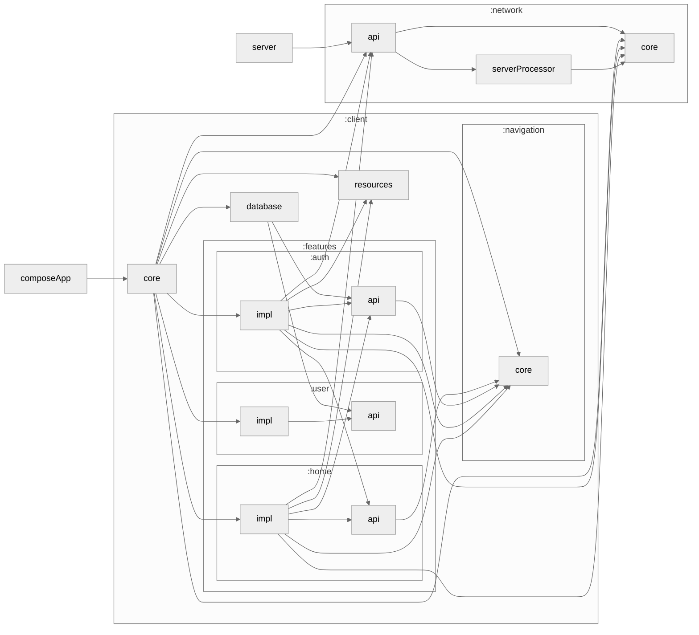

# Module Graph

```mermaid
%%{
  init: {
    'theme': 'neutral'
  }
}%%

graph LR
  :composeApp["composeApp"]
  :server["server"]
  subgraph :client
    :client:database["database"]
    :client:core["core"]
    :client:database["database"]
    :client:resources["resources"]
    :client:core["core"]
    subgraph :features
      subgraph :user
        :client:features:user:api["api"]
        :client:features:user:impl["impl"]
        :client:features:user:impl["impl"]
      end
      subgraph :auth
        :client:features:auth:api["api"]
        :client:features:auth:impl["impl"]
        :client:features:auth:api["api"]
        :client:features:auth:impl["impl"]
      end
      subgraph :home
        :client:features:home:impl["impl"]
        :client:features:home:api["api"]
        :client:features:home:api["api"]
        :client:features:home:impl["impl"]
      end
    end
    subgraph :navigation
      :client:navigation:core["core"]
    end
  end
  subgraph :network
    :network:api["api"]
    :network:core["core"]
    :network:serverProcessor["serverProcessor"]
    :network:api["api"]
    :network:serverProcessor["serverProcessor"]
    :network:core["core"]
    :network:api["api"]
  end

  :client:database --> :client:features:user:api
  :client:database --> :client:features:auth:api
  :client:features:user:impl --> :client:features:user:api
  :network:api --> :network:core
  :network:api --> :network:serverProcessor
  :client:core --> :client:features:user:impl
  :client:core --> :client:features:auth:impl
  :client:core --> :client:features:home:impl
  :client:core --> :client:database
  :client:core --> :client:navigation:core
  :client:core --> :network:api
  :client:core --> :network:core
  :client:core --> :client:resources
  :client:features:home:api --> :client:navigation:core
  :composeApp --> :client:core
  :client:features:auth:api --> :client:navigation:core
  :client:features:auth:impl --> :client:features:auth:api
  :client:features:auth:impl --> :client:features:home:api
  :client:features:auth:impl --> :client:navigation:core
  :client:features:auth:impl --> :network:api
  :client:features:auth:impl --> :network:core
  :client:features:auth:impl --> :client:resources
  :client:features:home:impl --> :client:features:home:api
  :client:features:home:impl --> :client:navigation:core
  :client:features:home:impl --> :network:api
  :client:features:home:impl --> :network:core
  :client:features:home:impl --> :client:resources
  :client:features:home:impl --> :client:features:auth:api
  :network:serverProcessor --> :network:core
  :server --> :network:api
```