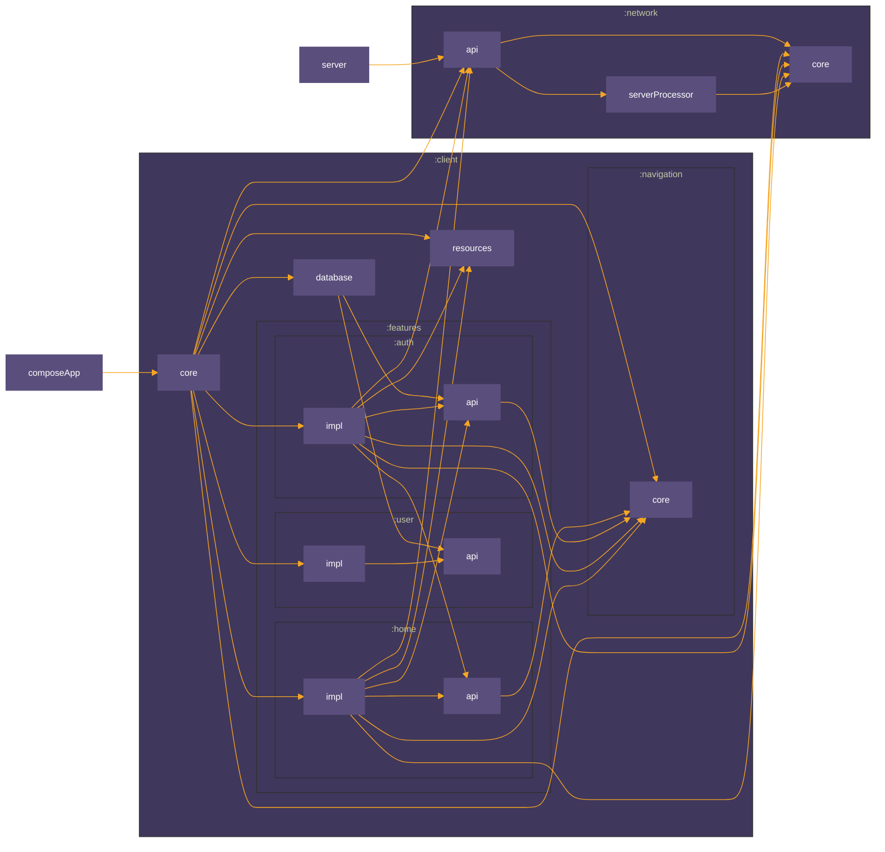

# 🏛️ ModernArchitecture KMP Template

> "Architecture is the art of organizing chaos. A great architect knows when to use a tool, and when
> to keep the toolbox closed."

This project is a high-performance, opinionated **Kotlin Multiplatform (KMP)** template designed for
enterprise-scale applications. It bridges the gap between frontend and backend using a **"Contract-First"** philosophy, ensuring that your Android, iOS, Desktop, and Ktor Server are always in perfect sync with zero boilerplate.

## 🚀 Key Philosophy

1.  **Contract-First (Kotlin Interface as Source of Truth):** API interfaces are defined once in a shared module (`:network`) and drive both the Client's HTTP requests (via Ktorfit) and the Server's routing logic (via a custom KSP processor). Unlike traditional Schema-First approaches (e.g., OpenAPI), here the **code** is the contract, guaranteeing full-stack type safety without external YAML files.
2.  **API/Impl Separation:** Feature modules are split into `:api` (public contract) and `:impl` (private implementation) to enforce strict encapsulation and speed up incremental build times.
3.  **"Just-in-Time" Architecture:** We reject the dogma of "Clean Architecture" that forces premature abstraction. Repositories or UseCases are created only when logic becomes complex or requires offline-first capabilities. Simplicity is the default.
4.  **Functional Package Structure:** The internal structure of features follows a functional approach (e.g., `ui/`, `logic/`, `data/`) rather than rigid layering, minimizing boilerplate for simple features.

## 🛠️ Getting Started

### Prerequisites
*   **JDK:** 17 (Required for Android/Gradle).
*   **Android Studio:** Ladybug (2024.2.1) or newer.
*   **Xcode:** 15+ (Required only if building the iOS target).

### Setup Guide
1.  **Clone the Repo:**
2.  **Sync Gradle:** Open the project in Android Studio and wait for indexing to complete.
3.  **Verify Environment:**
    *   Ensure your `local.properties` has `sdk.dir` pointing to your Android SDK.
    *   If you plan to run iOS from Android Studio, ensure the KMM plugin is active.

### Running the Application
#### 1. Backend (Server)
The client needs the backend to be running to function correctly.
*   **Run via Terminal:** `./gradlew :server:run`
*   **Address:** The server defaults to `0.0.0.0:8080`.
    *   Android Emulator access: `10.0.2.2:8080`.
    *   iOS Simulator access: `localhost:8080`.

#### 2. Client (Android / iOS / Desktop)
*   Select the `composeApp` (Android), `iosApp` (iOS), or `desktopApp` (Desktop) configuration in the Android Studio toolbar.
*   Select an Emulator or Simulator.
*   Click **Run**.

---

## 🏗️ Architecture & Module Structure

The project is organized into logical scopes to separate the "What" from the "How."

### 1. `network/` (The Shared Contract)
This is the heart of the full-stack architecture. It defines the contract between clients and the server.
*   **`api/`**: Contains pure Kotlin interfaces annotated with **Ktorfit** annotations (`@GET`, `@POST`). These interfaces (e.g., `UserApi`, `AuthApi`) are the single source of truth for your network API.
*   **`core/`**: Provides networking infrastructure:
    *   **`ClientBuilder`**: Configures the Ktor `HttpClient` and Ktorfit instance.
    *   **`safeApiCall`**: A wrapper for handling network requests and exceptions gracefully.
    *   **Security Annotations**: Markers like `@NoAuth` and `@AuthJwt` control access levels on API endpoints.
*   **`serverProcessor/`**: A custom **KSP (Kotlin Symbol Processing)** module that generates server-side Ktor routing code directly from the `network/api` interfaces. This ensures the server implementation always matches the client's contract.

### 2. `client/` (Frontend Application)
The client application, composed of a generic core, a database layer, and modularized features.
*   **`core/`**: The client entry point and generic utilities. It depends on all feature `:impl` modules to aggregate the full Dependency Injection graph.
*   **`database/`**: Centralized **Room** (KMP) database configuration. It aggregates `@Entity` classes from various feature API modules.
*   **`navigation/`**: A decoupled navigation engine based on the registry pattern.
*   **`resources/`**: Centralized UI resources (Strings, Drawables, Fonts) used by all feature modules.
*   **`features/`**: Vertical business slices of the application (e.g., Auth, Home). Each feature is split into two modules following the **API/Impl Split Pattern**.

### 3. `composeApp/` (Application Shell)
The main entry point for the client applications.
*   **Role**: Acts as the "Shell" that hosts the KMP application UI.
*   **Responsibilities**: Contains platform-specific bootstrapping (`MainActivity` for Android, `Main.kt` for Desktop, `MainViewController` for iOS), initializes Koin (delegating to `client:core`), and sets up the root UI.

### 4. `server/` (Backend Application)
A **Ktor** server application that implements the shared `network` contract.
*   **Routing**: Instead of manually defining routes, it uses the code generated by the `serverProcessor` to bind API implementations.
*   **Dependency Injection**: Uses Koin to provide implementations of the API interfaces.

### 5. `buildSrc/` (The Conductor)
Uses Gradle Convention Plugins to centralize and manage build logic, preventing duplication across the many project modules.

---

## Module Graph


## 🧩 The API/Impl Split Pattern

To ensure lightning-fast incremental builds and strict encapsulation, every feature in `:features` is divided into two Gradle modules.

### `:features:featureX:api`
*   **Purpose:** The public contract of the feature. Other modules can depend on this.
*   **Contents:**
    *   Navigation Destinations (e.g., `LoginDestination`).
    *   Public Interfaces (e.g., `TokenStore`).
    *   Database Entities (`@Entity`) and DAO interfaces. Placing them here allows the central `:database` module to see them while keeping all feature-related code co-located.

### `:features:featureX:impl`
*   **Purpose:** The private implementation of the feature. No other feature module should ever depend on an `:impl` module.
*   **Contents:**
    *   UI (Compose Screens).
    *   Logic (ViewModels, State).
    *   Dependency Injection (Koin modules providing DAOs, etc.).
    *   Navigation binders (`ScreenInjector`).

---

## ⚙️ Technical Details

### Shared Network (Full-Stack Type Safety)
This is the **"Killer Feature"** of this template.
1.  **Define Interface:** You write a Kotlin interface in `:network:api` with Ktorfit annotations.
    ```kotlin
    interface AuthApi {
        @POST("auth/login")
        @NoAuth
        suspend fun login(@Body request: LoginRequest): AuthResponse
    }
    ```
2.  **Client Generation:** Ktorfit auto-generates the network client implementation for Android, iOS, and Desktop.
3.  **Server Generation:** The custom `serverProcessor` KSP generates Ktor server routing blocks from the same interface.
    ```kotlin
    // In server/Application.kt, the generated function binds the implementation
    routing {
        bindAuthApi(get<AuthApi>()) // get() resolves AuthApi implementation from Koin
    }
    ```
**Result:** A change in the network interface causes a compile-time error in both the Backend and the Client. No more runtime parsing bugs or `404 Not Found` errors.

### State Management (UDF)
We use a **Unidirectional Data Flow (UDF)** pattern, similar to MVI.
1.  **State**: An immutable data class (e.g., `LoginState`) holding all data for the UI.
2.  **Events**: A sealed interface (e.g., `LoginEvent`) representing user actions.
3.  **ViewModel**: Holds state in a `MutableStateFlow`, exposes it as a read-only `StateFlow`, and processes events via a single `onEvent()` method.

### Navigation (Decoupled Registry)
Features do not know about each other; they only know about **Destinations**.
*   **Registry Pattern:** Each feature registers its screens into a global scope using a `ScreenInjector`.
*   **Zero-Knowledge:** Feature A navigates to Feature B by passing a `DestinationB` object. The navigation system resolves the correct Composable at runtime. This is achieved by retrieving a list of all `ScreenInjector` modules from Koin, each of which registers its own feature's screens.

### Database (Room KMP)
*   **Library:** `androidx.room` (KMP version) with an SQLite driver.
*   **Schema Management:** Schemas are exported to `client/database/schemas` and should be committed to version control.
*   **Architecture:** Entities and DAO interfaces are defined in feature `:api` modules, while the central `:database` module aggregates the entities to construct the `AppDatabase`.

### Security & Authentication Flow
*   **Token Storage**: Tokens are stored using a `TokenStore` interface backed by the Room Database.
*   **Interceptor**: A Ktor Client Plugin (`AuthPluginProvider`) automatically inspects API annotations (`@AuthJwt`, `@NoAuth`) and injects the `Authorization` header.
*   **Refresh Logic**: There is currently **no automatic token refresh** logic. A `401 Unauthorized` error must be handled by the ViewModel (e.g., by navigating to the login screen).

> [!WARNING]
> **Security Critical:**
> The default token storage mechanism uses a plain-text Room database. This is **highly insecure** and for demonstration purposes only. In a production environment, you **MUST** replace this with secure, platform-specific storage:
> *   **Android**: `EncryptedSharedPreferences` or `androidx.security.crypto.EncryptedFile`.
> *   **iOS**: `Keychain` (using a KMP wrapper library).

### Testing
*   **Stack**: `kotlin-test` for assertions, `kotlinx-coroutines-test` for coroutines, and [**Mokkery**](https://mokkery.dev/) for mocking.
*   **Location**: Unit tests for shared business logic are placed in the `commonTest` source set of `:impl` modules, ensuring they are platform-independent.

### Dependency Injection
*   **Library:** **Koin** with **Koin Annotations**.
*   **Usage:** `@KoinViewModel` for ViewModels, `@Single`/`@Factory` for services, and `@Module` for grouping providers.

## 🛠 Tech Stack

- **UI:** Compose Multiplatform (Android, iOS, Desktop)
- **DI:** Koin + Koin Annotations
- **Networking:** Ktor + Ktorfit + Custom KSP
- **Database:** Room KMP
- **Testing:** kotlin-test, Mokkery

## ⚠️ Trade-offs & Friction Points

Every architectural decision has a cost. Here are the trade-offs for using this template:

1.  **Module Explosion:** Splitting every feature into `:api` and `:impl` doubles the module count. A project with 20 features will have 40+ Gradle modules. This requires robust `buildSrc` management and a powerful CI machine.
2.  **Custom Tooling Maintenance:** The server-side routing relies on a Custom KSP Processor. You own this tool. If the Ktor DSL changes significantly, you must update your generator.
3.  **Database Build Dependency:** To keep all feature-related code co-located, `@Entity` classes and DAO interfaces are defined in each feature's public `:api` module. This provides excellent feature encapsulation. However, it means the central `:database` module must depend on every feature `:api` module to assemble the final database.
    *   **The Impact:** This is a deliberate trade-off. While adding a new entity causes the `:database` module to recompile, this does not trigger a massive build cascade. Since no feature module depends on the `:database` module (it contains only the `AppDatabase` class used by the root application), the recompilation is contained solely to the database module and the root app, preserving fast incremental builds for the rest of the project.
4.  **Strict Contracts:** You cannot "just code." You must define your data shape and interfaces *before* writing UI or server logic. This slows down initial prototyping but significantly speeds up long-term maintenance and prevents bugs.